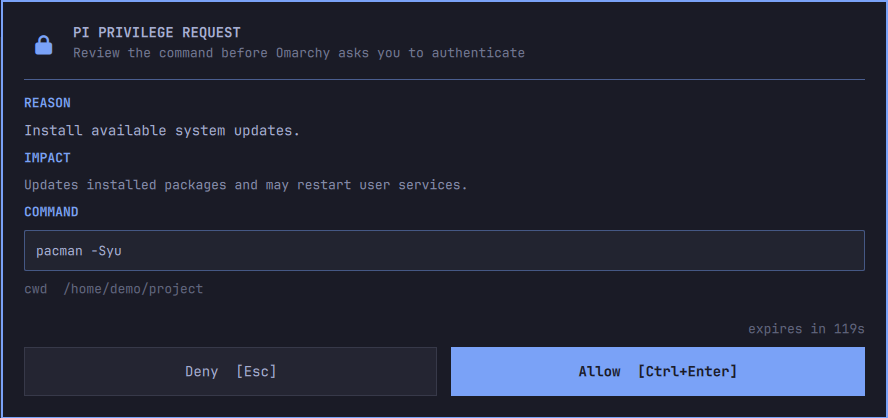

# pi-omarchy-sudo-prompt

Privileged commands should not wait invisibly.



`pi-omarchy-sudo-prompt` gives Pi an explicit root-command tool on Omarchy. The agent states the command, reason, and impact. You approve it on the desktop. Polkit handles authentication.

## Install

Requirements: Pi, `pkexec`, and a running Omarchy shell with its Polkit agent.

```sh
pi install git:git@github.com:adrunkhuman/pi-omarchy-sudo-prompt
```

Reload Pi after installation:

```text
/reload
```

The extension installs and enables its user-owned Omarchy service under `~/.config/omarchy/plugins/`. It may restart the Omarchy shell when those UI files change.

## How it works

1. The agent calls `privileged_exec(command, reason, impact)`.
2. The desktop shows the exact request.
3. You approve with a click or **Ctrl+Enter**. To deny, optionally type a short reply for the agent, then click **Deny**, press **Enter** in the reply field, or press **Esc**.
4. `pkexec` starts Omarchy's Polkit authentication flow.
5. The command runs as root only after both steps succeed.

Approved input runs as `/usr/bin/bash -c` from Pi's current directory. A root-side `timeout` stops it after ten minutes, and large output is truncated to Pi's normal tool limits. Once execution starts, canceling Pi cannot reliably stop the elevated process; its root-side timeout remains in force.

A command-position heuristic catches ordinary `sudo`, `sudoedit`, `doas`, `pkexec`, and `su` calls in Pi's Bash tool and Herdr's `run` and `send` actions. It does not parse shell syntax. The agent gets a short instruction to use `privileged_exec` instead.

Approval requests expire after two minutes. Long requests scroll; short requests stay compact.

## Scope

This catches ordinary agent mistakes and invisible password stalls. It is not a sandbox.

The guard sees commands present in those tool arguments. It cannot reliably inspect privilege escalation hidden inside downloaded scripts, build systems, encoded commands, or unrelated terminals.

The review screen never collects a password. Omarchy's Polkit agent owns authentication.

## Remove

```sh
pi remove git:git@github.com:adrunkhuman/pi-omarchy-sudo-prompt
omarchy-shell shell setPluginEnabled io.github.adrunkhuman.pi-omarchy-sudo-prompt false
rm -rf ~/.config/omarchy/plugins/io.github.adrunkhuman.pi-omarchy-sudo-prompt
```

That plugin directory is managed by this package. Inspect it before removing it if you edited or added files there.

Then reload Pi.

## Development

```sh
npm test
pi -ne -e .
```

The package is private and not published to npm.
